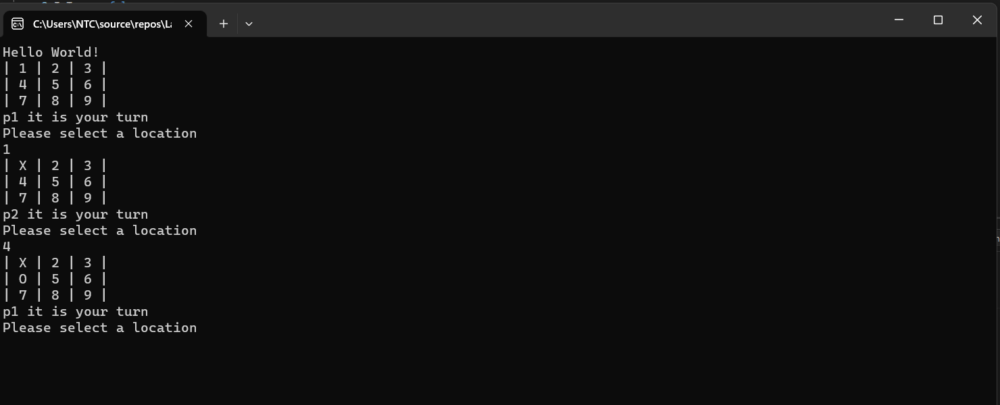

# Lab04_TicTacToe

this is a simple tic tac toe game that is 2 player game on the same console that lets the user take turns and the bord updates each time . there is many classes in the game as the board that is made and the position player and the player . 

 1.the game starts with showing the users the bord and asking p1 to type a number 1-9
 
 2.then the bord reapper and with the change for the number the player one had changed and it will be x or o 
 
 3. the player two will be able to choose a number form 1-9 minus the number that the first on choose .
    
 4 . the game goes on until one reach 3 o in a row/colomn/diagonal or 3 x in a row/colomn/diagonal .

 5.if they finshed the nubers with none of this done( one reach 3 o in a row/colomn/diagonal or 3 x in a row/colomn/diagonal) the game will show the draw .
 
